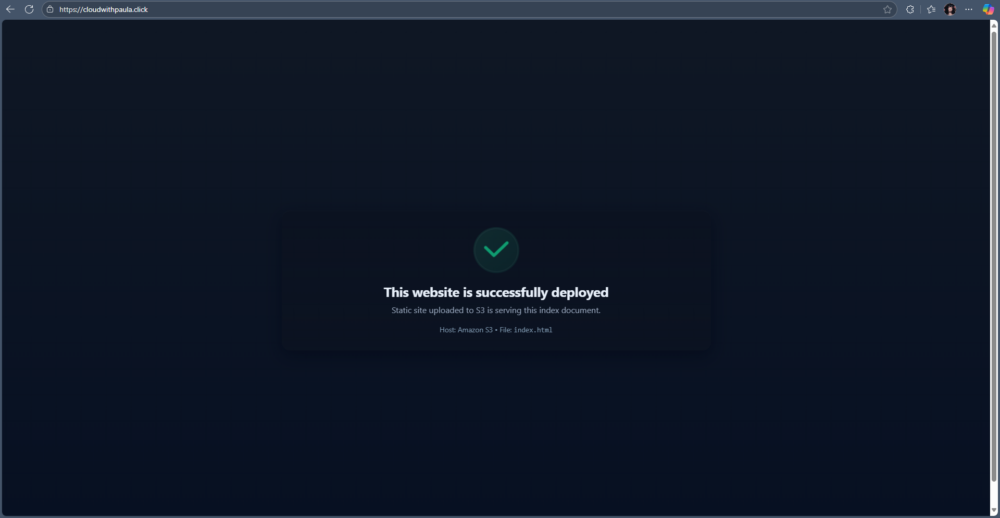

# AWS Static Website Hosting with S3, CloudFront, Route 53, ACM, and CloudWatch

This project demonstrates how to host a secure static website using various AWS services under the **Free Tier**.  
It includes **SSL/TLS encryption**, **domain management**, **CDN caching**, and **monitoring** with CloudWatch.

---

## Architecture Overview


## Deployed Website Preview
Here’s a screenshot of the static website successfully deployed via Amazon S3 and CloudFront.



---

## AWS Services Used

- **Amazon S3** – Hosts static website files (`index.html`, `error.html`)  
- **Amazon CloudFront** – CDN (Content Delivery Network) for global content delivery and HTTPS encryption  
- **AWS Certificate Manager (ACM)** – Provides free SSL/TLS certificates for secure HTTPS  
- **Amazon Route 53** – Manages the custom domain and DNS records  
- **Amazon CloudWatch** – Logs and monitors CloudFront activity for analytics and performance insights  

---

## Example Website URL

**https://cloudwithpaula.click**  
*(This website was hosted temporarily for demonstration purposes using AWS Free Tier resources.)*
---

## Step-by-Step Setup Summary

### 1️⃣ Create an S3 Bucket
- Name the bucket after your domain name (e.g., `cloudwithpaula.click`)  
- Enable *Static Website Hosting*  
- Upload `index.html` and `error.html`
- Configure the error document as `error.html`
- Make the bucket publicly accessible  

### 2️⃣ Request a Certificate (ACM)
- Open *AWS Certificate Manager* in us-east-1 (N. Virginia)  
- Request a certificate for your root domain (`cloudwithpaula.click`)
- Validate via **DNS using Route 53**  
- Wait for the certificate to be **Issued**

### 3️⃣ Create a CloudFront Distribution
- **Origin domain:** your S3 *website endpoint*  
- Attach your **ACM certificate** (from us-east-1)  
- Add domain name: `cloudwithpaula.click` 
- Redirect **HTTP → HTTPS**
- Set Custom Error Page (error.html) for 404 responses

### 4️⃣ Configure Route 53
- Create an **A record (alias)** pointing your domain to the CloudFront distribution  

### 5️⃣ Enable CloudWatch Logging
- Go to **CloudFront → General → Logging and monitoring**  
- Create an **Access Log Delivery** to an S3 bucket  
- View logs in **CloudWatch Logs**

---

## Error Page Configuration

An `error.html` file was uploaded to the S3 bucket to display a custom **404 Not Found** page for invalid paths.  

Example:  
`https://cloudwithpaula.click/thispagedoesnotexist`

---

## Teardown & Cost Management

To stay within the Free Tier, remove resources after testing:

- Delete CloudFront distribution
- Delete S3 bucket (after downloading your files)
- Delete Route 53 hosted zone (if unused)
- Remove ACM certificate if no longer needed
- Disable CloudWatch logs to prevent storage costs
> 🧹 All configurations can be redeployed later if needed.

---

## Learning Outcomes

- Deployed a static website using AWS global infrastructure
- Configured HTTPS via ACM and CloudFront
- Implemented custom error handling with error.html
- Managed DNS routing with Route 53
- Enabled CloudWatch logging for performance insights
- Practiced cost-efficient resource management

---

## Repository Structure

```plaintext
aws-static-website-deployment/
│
├── README.md                ← this documentation  
├── architecture-diagram.gif ← architecture image  
├── index.html               ← static site file
├── error.html               ← custom error page (404)  
└── cloudfront-logs-example/ ← sample CloudFront access log
```
---
### CloudFront Logs
CloudFront logging was enabled and configured to store logs in an S3 bucket.
A sample log file (sample-log.json) is included in the cloudfront-logs-sample/ folder to demonstrate logging and monitoring setup.

---
### Author
**Paula Kim**  
Cloud & AI Enthusiast  
